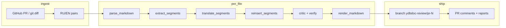

# Architecture — ydbdoc-review v2

This document describes the **v2 AST pipeline** on branch `doc-translate-ng`. For
narrative design rationale, see [Memory Bank](MEMORY_BANK.md).

## High-level flow

## Package map

| Package | Responsibility |
|---------|----------------|
| `parsing/` | markdown-it-py + YFM plugins → pydantic AST (`Document`, block/inline nodes) |
| `segmentation/` | AST → `Segment` list; inline atoms protected as `KIND:n` placeholders |
| `rendering/` | AST → stable markdown (round-trip tests) |
| `translation/` | Glossary, prompt templates, translator + critic LLM calls |
| `validation/` | Structural checks (placeholder parity, CLI tokens); heuristics (Phase E) |
| `navigation/` | Scoped merge for `toc.yaml` and redirect lists |
| `pipeline/` | `translate_file`, pair planning, PR orchestrator |
| `github/` | REST client, local git ops, `run_doc_translate` / `run_doc_verify` |
| `reporting/` | Markdown reports for source and translation PRs (§17) |
| `llm/` | Yandex AI Studio client (OpenAI SDK), retry, usage tracking |
| `config/` | `default.yaml` + env overrides + secrets |

## Per-file pipeline

`pipeline/translate_file.py`:

1. **Parse** source markdown to AST.
2. **Extract** translatable segments (headings, prose, table cells, note bodies, …).
3. **Translate** segments in char-budget batches (`translation/translator.py`); per-PR segment cache.
4. **Reinsert** translations into a copy of the AST (`segmentation/reinsert.py`).
5. **Critic** reviews target text; applies fixes via `suggested_text` per `segment_id` (not find/replace).
6. **Verify** pass on unresolved issues (optional second critic call).
7. **Render** final markdown.

Flags: `enable_translate=False` for verify-only; `existing_target_text` for critic on existing EN.

## PR-level orchestration

`pipeline/orchestrator.py` — sequential files, shared cache:

1. **Enumerate** changed paths (`github/git_ops.list_local_changes` or GitHub API).
2. **Pair** `docs/ru/X.md` ↔ `docs/en/X.md` (`pipeline/pairs.py`).
3. **Plan** deterministic full re-translate from PR source (`pipeline/analyze.py`, §6.30).
4. **Run** `translate_file` per planned pair; partial failure skips file, continues PR.
5. **Git** — branch from source PR head, commit, push (`github/git_ops.py`).
6. **GitHub** — open/find translation PR, post short + full reports (`reporting/builder.py`).

## Configuration

- Packaged defaults: `config/default.yaml`.
- Override: `YDBDOC_LLM_*`, `YDBDOC_TRANSLATION_*`, `YDBDOC_PATHS_*`, …
- Secrets never in YAML: `YDBDOC_YC_FOLDER_ID`, `YDBDOC_YC_API_KEY`, `GITHUB_TOKEN`.

Model URI format: `gpt://<folder_id>/<model_slug>` (constructed in `YandexLLMClient`).

## GitHub Action

- **Image:** `Dockerfile` → `entrypoint.sh` → `ydbdoc-review run|verify`.
- **Inputs:** `repo`, `pr`, `merge_base_with`, `mode`, `dry_run`, `no_commit`.
- **Workspace:** docs repo mounted at `GITHUB_WORKSPACE`; entrypoint remaps runner paths.

## Extension points

| Change | Where |
|--------|--------|
| New YFM construct | `parsing/yfm_plugins/` + renderer + segmentation if translatable |
| New LLM role | `config/default.yaml`, `llm/client.py`, prompts under `prompts/v1/` |
| New heuristic | `validation/heuristics.py`, wire in `translate_file` |
| Report format | `reporting/builder.py`, Memory Bank §17 |

## v1 vs v2

v1 (tag `v0.1.0` on `main`) used line/region masking and TOML config. v2 replaces
that with a structured AST, pydantic JSON schemas for LLM I/O, and YAML config.
The Action entrypoint interface (`action.yml` inputs) is preserved for the `ydb` repo.

## Testing layers

1. **Unit** — parser, segmentation, mocked LLM (`tests/unit/`).
2. **Fixture integration** — 33 real doc pairs round-trip (`test_real_files_round_trip.py`).
3. **LLM smoke** — opt-in `@pytest.mark.llm` (`test_llm_smoke.py`).
4. **E2E on real PRs** — manual / planned; not MVP CI gate.

Target: **90%+** line coverage on core packages (see Memory Bank §7).
