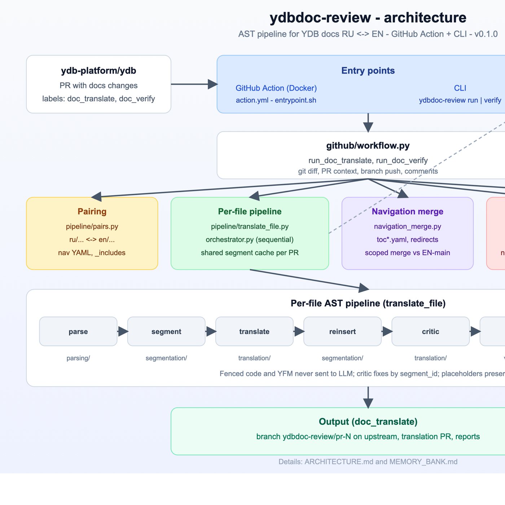

# ydbdoc-review

GitHub Action и CLI для автоматического перевода документации YDB (**RU ↔ EN**) с QA-критиком.

Релиз: **`v0.1.0`** на ветке `main` — AST-пайплайн: parse → segment → translate → critic → render.

## Архитектура



| Слой | Пакет | Назначение |
|------|--------|------------|
| Вход | `action.yml`, `cli.py` | GitHub Action (Docker) или локальный CLI |
| Оркестрация | `github/workflow.py` | `doc_translate` / `doc_verify`, git, PR, комментарии |
| Пары | `pipeline/pairs.py` | `docs/ru/…` ↔ `docs/en/…`, locale `_includes`, nav YAML |
| Перевод | `pipeline/translate_file.py` | AST-пайплайн на файл |
| Навигация | `pipeline/navigation_merge.py` | Scoped merge `toc*.yaml` и redirect YAML |
| QA | `validation/`, `translation/critic.py` | Эвристики, fence integrity, nav gates |
| Отчёты | `reporting/builder.py` | 🟢/🟡/🔴, токены, оценка стоимости |
| LLM | `llm/client.py` | Yandex AI Studio (OpenAI-compatible API) |

Подробнее: [ARCHITECTURE.md](ARCHITECTURE.md) · [Memory Bank](MEMORY_BANK.md) · [CONTRIBUTING.md](CONTRIBUTING.md)

## Что делает

### `doc_translate` (лейбл на исходном PR)

1. Находит изменённые пары `ydb/docs/ru/…` ↔ `ydb/docs/en/…` (включая locale `_includes/*.md`).
2. Переводит `.md` через Yandex AI Studio; мержит изменённые `toc*.yaml` / redirect YAML.
3. Запускает **critic** + эвристики; применяет безопасные правки по `segment_id`.
4. Пушит ветку `ydbdoc-review/pr-<N>` в **upstream**, открывает **translation PR**, комментирует оба PR.

### `doc_verify` (лейбл на translation PR)

Повторный QA без перевода: critic + heuristics + nav validation; при необходимости commit fix-ов и новый отчёт.

Исходная ветка PR **не меняется**. Мерж translation PR — за человеком.

## Требования

- Python **3.11+** (локально) или Docker (GitHub Action).
- **Yandex AI Studio:** folder id + API key.
- **GitHub:** `GITHUB_TOKEN` (в CI — job token с `permissions` в workflow; локально — PAT в `.env`).

## Быстрый старт (локально)

```bash
git clone https://github.com/ydb-platform/ydbdoc-review.git
cd ydbdoc-review
python3 -m venv .venv && source .venv/bin/activate
pip install -e ".[dev]"
cp .env.example .env   # YDBDOC_YC_* и GITHUB_*
```

Клон репозитория с доками и checkout PR:

```bash
git clone https://github.com/ydb-platform/ydb.git /path/to/ydb
cd /path/to/ydb
gh pr checkout <N>
git fetch origin main
```

Dry-run (без записи и комментариев):

```bash
ydbdoc-review run \
  --repo ydb-platform/ydb \
  --pr <N> \
  --repo-path /path/to/ydb \
  --merge-base-with origin/main \
  --dry-run
```

Полный прогон:

```bash
ydbdoc-review run \
  --repo ydb-platform/ydb \
  --pr <N> \
  --repo-path /path/to/ydb \
  --merge-base-with origin/main
```

Verify на translation PR:

```bash
ydbdoc-review verify \
  --repo ydb-platform/ydb \
  --pr <translation_pr> \
  --repo-path /path/to/ydb \
  --merge-base-with origin/main
```

## CLI

| Команда | Назначение |
|---------|------------|
| `run` | `doc_translate` — перевод + ветка + PR + комментарии |
| `verify` | `doc_verify` — critic-only QA на translation PR |
| `list-models` | Цепочки моделей из config; `--live` — GET `/v1/models` |
| `translate-file` | Один `.md` локально, без GitHub |
| `extract` | Сегменты файла (debug), `--format json\|text` |

```bash
ydbdoc-review translate-file docs/ru/page.md -o /tmp/en.md
ydbdoc-review extract docs/ru/page.md --format json
ydbdoc-review list-models --live
```

Эквивалент: `python -m ydbdoc_review …`

## Конфигурация

- Defaults: `src/ydbdoc_review/config/default.yaml` (в пакете).
- Overrides: env `YDBDOC_<SECTION>_<KEY>` — см. `.env.example` и [Memory Bank §13](docs/memory-bank/06-llm-config.md).
- Секреты из env: `YDBDOC_YC_*` (или `YANDEX_CLOUD_*` в workflow ydb), `GITHUB_TOKEN`.
- Опционально `GITHUB_PUSH_TOKEN` — только если push job-токеном в CI даёт 403.

## GitHub Action

`action.yml` в корне. Примеры workflow для **ydb** — [`examples/`](examples/).

```yaml
permissions:
  contents: write
  pull-requests: write
  issues: write   # лейблы documentation + rebuild_docs

uses: ydb-platform/ydbdoc-review@v0.1.0
env:
  YANDEX_CLOUD_FOLDER_DOC_REVIEW: ${{ secrets.YANDEX_CLOUD_FOLDER_DOC_REVIEW }}
  YANDEX_CLOUD_API_KEY_DOC_REVIEW: ${{ secrets.YANDEX_CLOUD_API_KEY_DOC_REVIEW }}
  GITHUB_TOKEN: ${{ secrets.GITHUB_TOKEN }}
  YDBDOC_REPO_PATH: ${{ github.workspace }}
```

**Checkout:** `fetch-depth: 0` и `git fetch` базовой ветки PR обязательны для `merge-base`.

**Fork PR:** ветка перевода пушится в **upstream** `ydb-platform/ydb` от `main` (не от head форка); EN toc для nav merge читается с upstream, если на checkout форка нет EN-файлов (§6.44). Отдельный `YDBDOC_PUSH_PAT` для push **не нужен** (см. Memory Bank §16.7).

**Docs rebuild:** post-step вешает `rebuild_docs` на translation PR. События от `GITHUB_TOKEN` **не запускают** другие workflow в GitHub — для автоматического `Build documentation` может понадобиться PAT или ручной re-add лейбла / `workflow_dispatch`.

## Тесты

```bash
pytest tests/unit/ tests/integration/test_real_files_round_trip.py
pytest tests/integration/test_llm_smoke.py -m llm   # локально, с ключами
```

## Документация

| Документ | Аудитория |
|----------|-----------|
| [README.md](README.md) | пользователи Action / CLI |
| [architecture.svg](architecture.svg) / [architecture.png](architecture.png) | схема компонентов (PNG в README — GitHub не рендерит локальный SVG) |
| [ARCHITECTURE.md](ARCHITECTURE.md) | архитектура v2, package map |
| [CONTRIBUTING.md](CONTRIBUTING.md) | разработчики |
| [MEMORY_BANK.md](MEMORY_BANK.md) | полный design doc (index) |

## Лицензия

Уточните лицензию при публикации (рекомендуется согласовать с политикой YDB).
