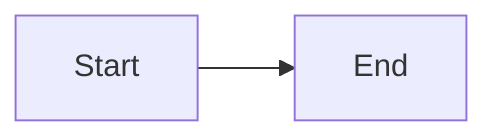

# Configuration {#setup}

The first sentence has **emphasis** and a [link](guide.md).
The second contains `code`.

- First item.

  Item continuation.
  - Nested item.

> First quote.
>
> Second paragraph of the quote.

| Name | Value |
|---|---|
| Key | Value |

#|
|| Name | Description ||
|| Row | Text | Extra cell ||
|#


Note body.



- First tab

  Tab body.



Section body.



Main branch.

Fallback branch.


[*term]: Term definition.

```python
# Comment
print("Message")
```




