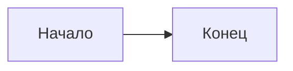

# Настройка {#setup}

Первое предложение с **акцентом** и [ссылкой](guide.md).
Второе содержит `код`.

- Первый пункт.

  Продолжение пункта.
  - Вложенный пункт.

> Первая цитата.
>
> Второй абзац цитаты.

| Имя | Значение |
|---|---|
| Ключ | Значение |

#|
|| Имя | Описание ||
|| Строка | Текст | Дополнительная ячейка ||
|#


Тело заметки.



- Первая вкладка

  Тело вкладки.



Тело секции.



Основная ветка.

Запасная ветка.


[*term]: Определение термина.

```python
# Комментарий
print("Сообщение")
```




